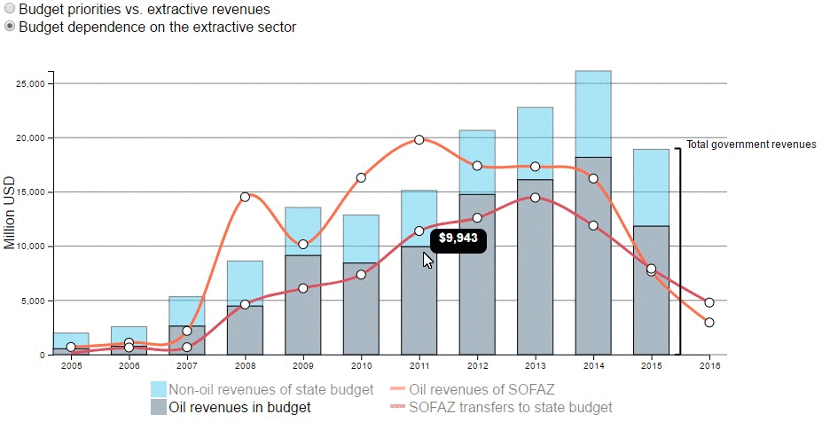
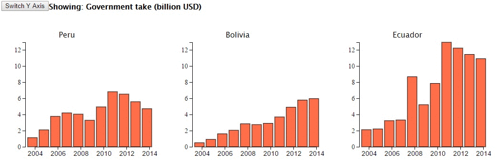
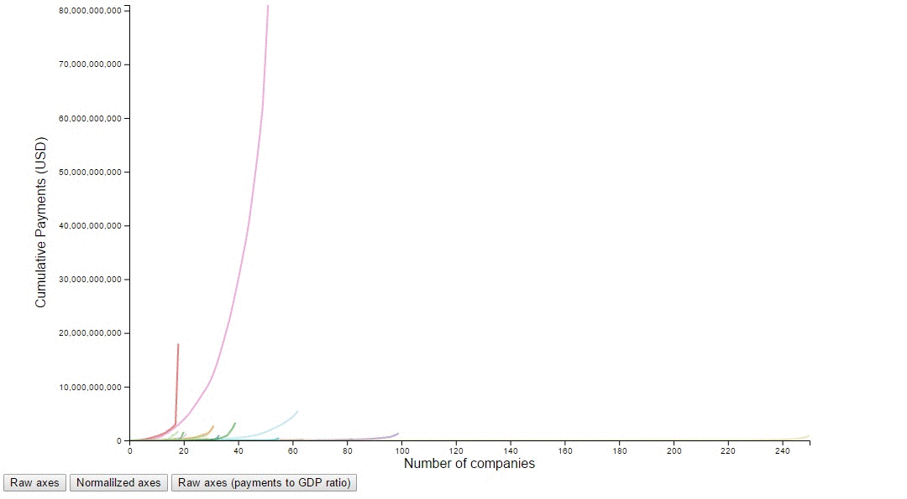
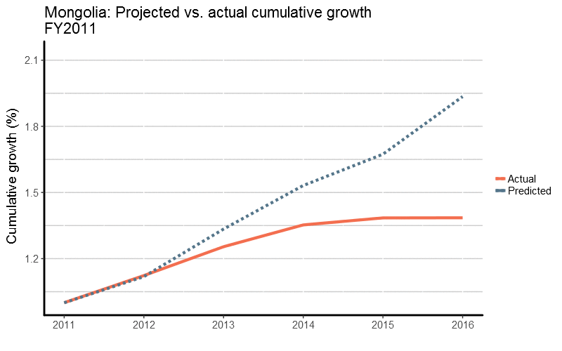

# data-visualization-gallery

A library of data visualizations done by the data team at NRGI.

### Azerbaijan budget data
A mix of bar graphs and line graphs showing budget and oil revenue data over 10 years. The bars allow for easy comparison of changes in both the entire group and the subcategories individually. Interactivity includes values displayed on mouse hover, emphasis of specific series on mouse hover and multiple sets of indicators to view. Visually appealing transitions capture attention.

Data sources used: 
- Budget data

Final version: [Link](http://nrgi.github.io/D3/AZ/AZ_stacked.html)
 

Earlier draft: [Link](http://nrgi.github.io/D3/AZ/AZ_indicators.html)
* This version includes only lines, which may be appropriate for certain data

### Andean database - cross-country visualization
Using the same indicators from three countries, this visualization shows the differences in total annual production value of extractive industries and government take from those industries across multiple years. Interactivity includes dynamic selection of indicator and highlighting years for comparison between countries.

Data sources used:
- Andean database

Final version: [Link](http://nrgi.github.io/D3/govtTake.html)
 

### EITI company payment comparison
This visualization displays company payment data in three unique views across multiple countries. Based on the income inquality measure known as the Lorenz Curve, this graph shows how the total amount of money received by a country is distributed between all companies making payments. Sorted by company from lowest to highest total payment amounts (in one year, 2013), a single line shows how much of the total payments the lowest x (or x percent) of companies paid out of the total in a single country. For countries where a small percent of companies pay a very large percent of the total extractive revenue, the far right of the curve will be very steep. For countries with more equitable distribution of payments among companies, the curve will be flatter towards the center.

Interactive components include highlighting lines and identifying the country on hover and three options for viewing the data: percent, raw and percent of GDP.

Data sources used:
- EITI summary data

Final version: [Link](http://nrgi.github.io/D3/giniGraph.html)

 

### Animated Gifs
The animated gif visualization is good for showing changes in data over time and for use on social media. This example was developed by the data team using predicted and actual economic growth data. It shows the changes in predicted growth over five years while showing the actual growth at the same time.

